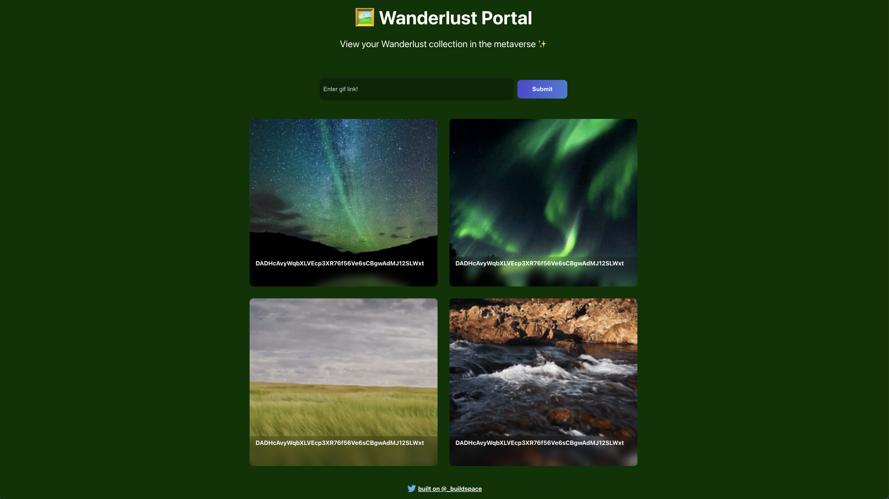

# buildspace Solana GIF Portal Project - Wanderlust Portal

This project allows you to submit GIF Links and store them in the Solana Blockchain, it uses Anchor to handle the deployment of the program to the Blockchain.

*Note:* the program runs in the devnet on the Solana Blockchain, to play with the app a solana wallet like [Phantom](https://phantom.app/) is needed, to get some tokens you might use [https://solfaucet.com/](https://solfaucet.com/)

## Test Program

- `solana config set --url devnet` : Specify which network will be used
- `solana airdrop 2 INSERT_YOUR_PHANTOM_PUBLIC_ADDRESS_HERE  --url devnet`: Get some solana tokens to use on fees
- `anchor test`: Compile and deploy program to the Solana Blockchain

